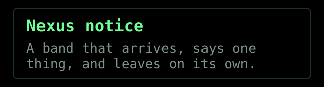
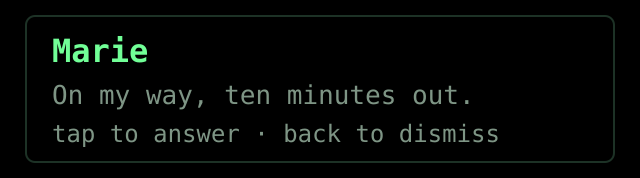
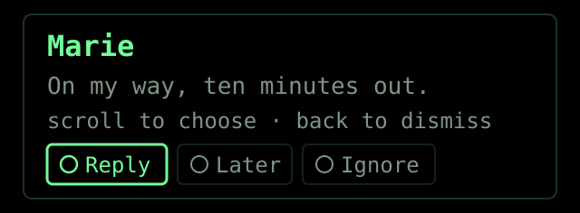
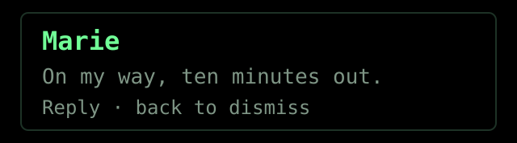
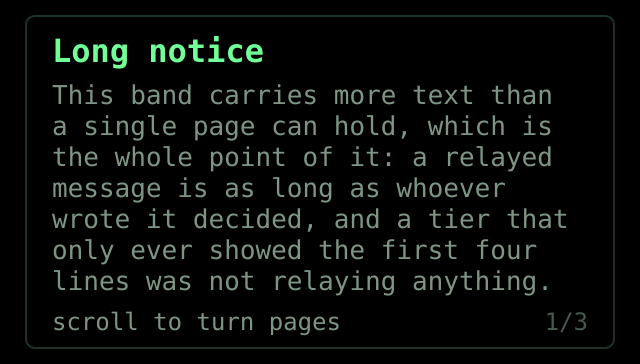
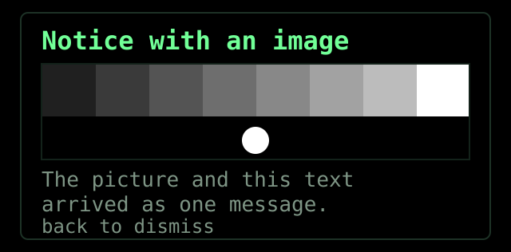

# The notice band — six states

A **notice** is the HUD's interruption: a band that arrives across the top of
the optic, says one thing, and leaves. It is not a screen, and it is never
scrolled. This page shows every shape it can take and what each one costs the
wearer in attention and in input.

The colours are the renderer's own — phosphor `#71FF97` on pure black, because
the optics are additive and emit nothing for black, so a black fill reads as
transparent and only the border and the text light up. The band spans 92% of
the optic's width. A notice lives between 2 and 45 seconds, or until the reader
stops turning pages, and **BACK dismisses it in every state**.

> For the same thing with a working state machine you can click through, open
> [`notice-band-states.html`](notice-band-states.html) in a browser. The wire
> contract itself lives in [BUSSPEC.md](../BUSSPEC.md); this page is the
> picture of it.

---

## 1. Plain band

Neither `interactive` nor actions. It says its piece and leaves on its TTL.

It listens to **nothing**: every gesture passes straight through to whatever is
underneath, so a banner cannot make the surface behind it feel broken.

| | |
|---|---|
| Keys claimed | none (BACK dismisses, as everywhere) |
| The plugin hears | nothing |

## 2. Interactive band

`interactive = true`, no actions. One possible answer: the confirming tap.

This works with no surface open at all — a dormant plugin can be shown and
answered without ever drawing a screen.

| | |
|---|---|
| Keys claimed | confirm only (touchpad tap, temple tap, ring tap) — scroll passes through |
| The plugin hears | `/notice/input`, once; the band then goes inert |

## 3. Band with actions

Up to three answers. Scroll moves the selection, the confirming tap fires it.

Scroll is claimed **only while a row is up** — a band without actions lets it
through. The selected chip is the one outlined in phosphor.

| | |
|---|---|
| Keys claimed | confirm, and scroll while the row is up |
| The plugin hears | `/notice/action` with the chosen `id`, once |

## 4. Answered

A notice takes **exactly one answer**, of either kind. The moment it is given,
the row leaves the band, nothing is claimed, and nothing fires again.

The row leaves because the question has been answered — what remains is an
inert display the owner can keep updating. The TTL runs on unchanged: answering
buys no extra time.

| | |
|---|---|
| Keys claimed | none — the band is a display again |
| The plugin hears | nothing more; a second tap is refused by the phone (`already_answered`) |

## 5. Paged

A body longer than one page holds. Scroll turns pages; **nothing scrolls** —
each page replaces the one before it, because a HUD that scrolls asks the
wearer to aim at something while walking.

It carries no actions, and that is the rule rather than a coincidence: a notice
is **paged or answerable, never both**, so forward and backward never have two
meanings at once. The page counter on the right is drawn by the platform, next
to whatever footer the plugin wrote.

The glasses decide how many pages this is. They are the only side that has
measured how wide a line actually runs, so nothing upstream — not the phone,
not the plugin — ever knows a page exists.

| | |
|---|---|
| Keys claimed | forward and backward, to turn pages |
| The plugin hears | nothing — it sent text, not a page count |
| Lifetime | the first page turn ends the countdown; from then on a 30 s inactivity timeout that every gesture restarts |

That last row is the point of the state: the band waits on the reader instead
of on a deadline. Take the glasses off mid-message and it still leaves on its
own rather than parking itself in your vision.

## 6. With an image

The picture travels **inside the `notice/show` envelope itself**, so the band
cannot appear before its image — they are the same message. There is no
half-arrived state to design around, and no deadline to tune: a transfer that
fails fails the whole envelope, and the plugin is told and can re-show without
the picture.

It draws on the first page only. A picture is worth the first screen, not a tax
on every one, so later pages get the full reading window back.

The test card above is what the sample plugin actually sends. It is a
brightness ramp rather than a photograph on purpose: on additive monochrome
optics, a ramp shows immediately which levels reach the eye and which vanish
into the background, which a nice picture would only hide.

| | |
|---|---|
| Carried as | JPEG or PNG, at most 64 KiB, longest edge 512 px — the same caps and decode path the surface tier already uses |
| Costs | five of the eight body lines on the first page |
| Only on show | `notice/update` refuses a binary frame; replacing the picture means a fresh show |

---

## Choosing this tier at all

The notice is one of four HUD tiers, and picking the wrong one is the most
common way to make a plugin feel wrong:

| What you have | Tier |
|---|---|
| An ongoing process the wearer follows | **activity** |
| A discrete event needing attention or an answer | **notice** |
| An engaged interaction the wearer is driving | **surface** |
| A trivial static fact that just needs to stay put | **pin** |

If there is a state machine behind it, it is an activity, not "a notice that
keeps updating".
